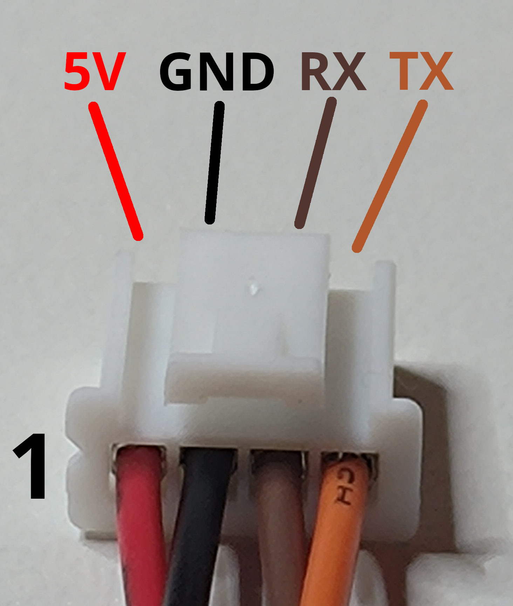
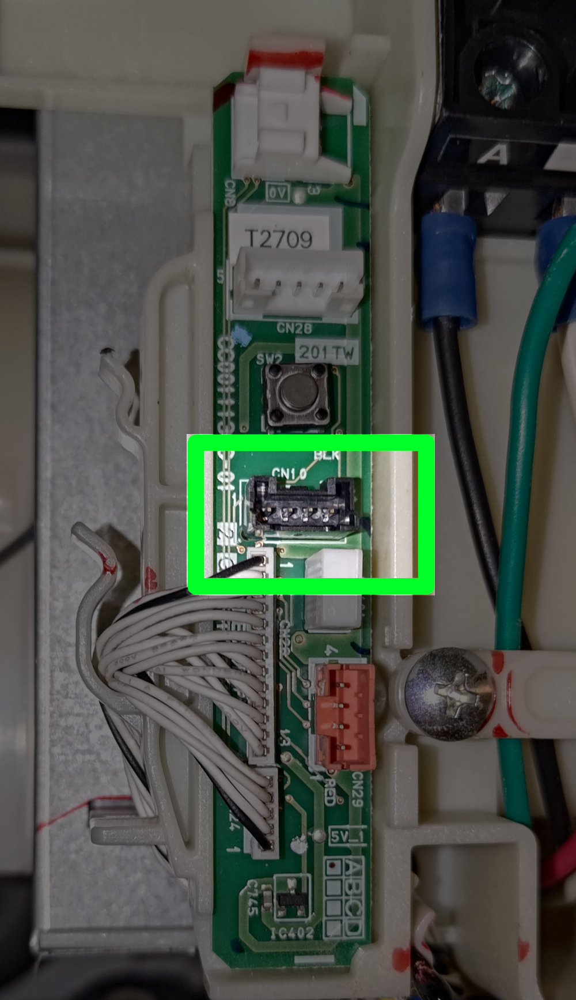
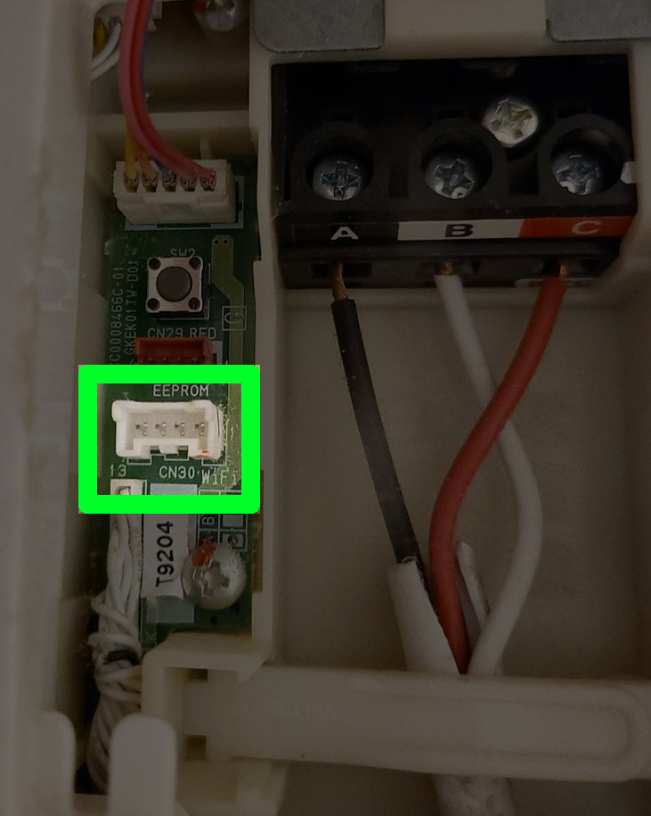
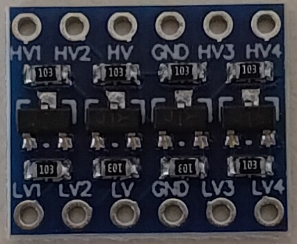
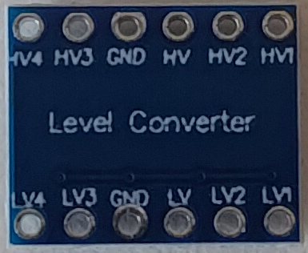

# ESPHome TaiXia Custom Component

## Special Thank
  ### Thanks for Andrew Wang provide the related hardwares and datasheet.
  ### Thanks for Seven Hong provide Air Conditioners for test and donate $150.
  ### Thanks for Mr. Wang and Mr Huang donate $230 and $200.

## Hardware

### Hitachi

Connector used is a JST PAP-04-V ([datasheet](https://www.jst-mfg.com/product/pdf/eng/ePA-F.pdf))

<br>Connector is pictured above.

_Note:_ The cables have been rearranged in the connector to help identify the wires. Cables bought online will have a different color scheme and location inside the connector.

<br>Connector header is pictured above - `CN10`.

<br>Connector header is pictured above - `CN30`.

|From appliance|Description|To ESP8266|Description|
|:-:           |:-:        |:-:       |:-         |
|1 |`5V`  |`Vcc` |`5V` on ESP                            |
|2 |`GND` |`GND` |`GND` on ESP                           |
|3 |`RX`  |`TX`  |Data sent **to** appliance at 5V TTL   |
|4 |`TX`  |`RX`  |Data sent **from** appliance at 5V TTL |

Note that the appliance uses 5V TTL logic levels. For ESP devices that are not 5V tolerant (like most of them), you need to use a level shifter and the on-board 3V3 power from the ESP device.

Example level shifter:

 

|From appliance|Description|To level shifter|To ESP|Description|
|:-:           |:-:        |:-:             |:-:   |:-         |
|1 |`5V`  |`HV`  |`5V`  |This will power the ESP device         |
|2 |`GND` |`GND` |`GND` |                                       |
|3 |`RX`  |`HV1` |-     |Data sent **from** ESP at 5V TTL       |
|4 |`TX`  |`HV2` |-     |Data sent **to** ESP at 5V TTL         |
|- |-     |`LV`  |`3V3` |3V3 provided by the ESP device         |
|- |-     |`LV1` |`TX`  |Data sent **to** appliance at 3V3 TTL  |
|- |-     |`LV2` |`RX`  |Data sent **from** appliance at 3V3 TTL|

### Panasonic
|Pin|Meaning|
|---|-------|
|1||
|2||
|3||
|4||

## Installation
Set `wifi_ssid` and `wifi_password` in your esphome's `secrets.yaml` first

1. Place the folder 'taixia' into the components of your esphome configuration folder
2. Create new device with the yaml in this repository
3. Or you can check the example "climate-taiseia.yaml" or "fan-taiseia.yaml"

## Configuration Example

```yaml
logger:
  baud_rate: 0  # Disable UART logger if using UART0 (pins 1,3)

external_components:
  - source: github://tsunglung/taixia
    components: [ taixia ]

uart:
  id: uart_taixia
  tx_pin: GPIO0
  rx_pin: GPIO1
  baud_rate: 9600
  debug:
    direction: BOTH

taixia:
#  max_length: 28   # Option to limit the max length of RX buffer

climate:
  - platform: taixia
    name: My Daikin Climate
    supported_modes:
      - COOL
      - HEAT
      - DRY
      - FAN_ONLY
    supported_fan_modes:
      - LOW
      - MEDIUM
      - HIGH
      - AUTO
    supported_presets:
      - ECO
      - BOOST
      - AWAY
      - SLEEP

switch:
  - platform: taixia
    type: airconditioner
    power:
      name: "${upper_devicename} Power Switch"

sensor:
  - platform: taixia
    type: airconditioner
    temperature_indoor:
      name: My Daikin Inside Temperature
    humidity_indoor:
      name: My Daikin Outside Temperature

number:
  - platform: taixia
    type: airconditioner
    vertical_fan_speed:
      name: "${upper_devicename} Vertical Fan Speed"
    horizontal_fan_speed:
      name: "${upper_devicename} Horizontal Fan Speed"

select:
  - platform: taixia
    type: airconditioner
    fuzzy_mode:
      name: "${upper_devicename} Fuzzy Mode"

text_sensor:
  - platform: taixia
    sa_id:
      name: "${upper_devicename} SA ID"
    brand:
      name: "${upper_devicename} SA Brand"
    model:
      name: "${upper_devicename} SA Model"
    version:
      name: "${upper_devicename} SA Version"
    services:
      name: "${upper_devicename} SA Services"

# Optional additional component.
```
The climate example exported to Home Assistant

